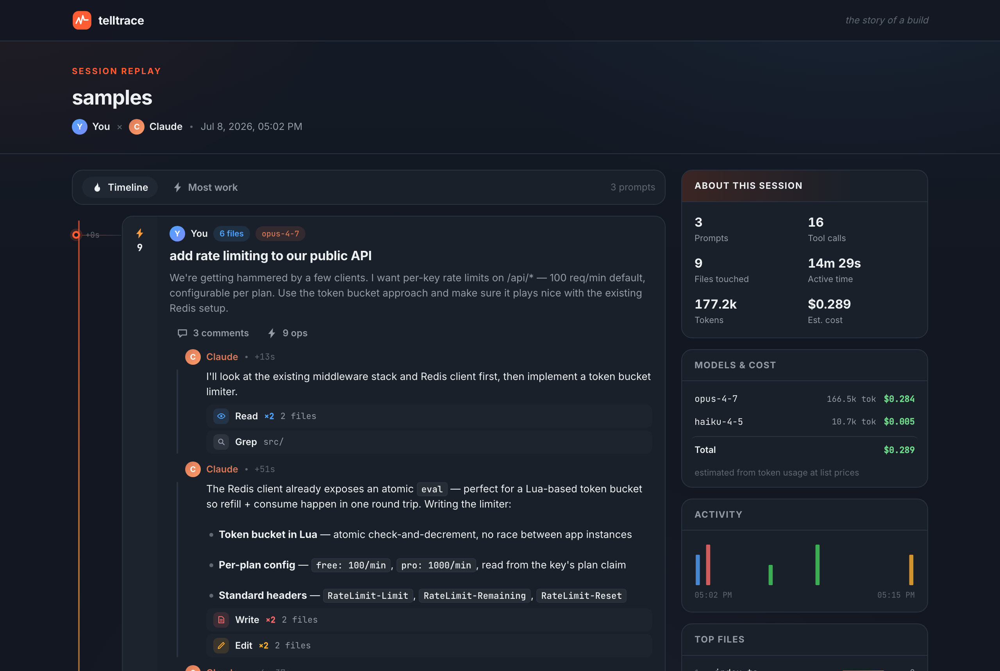

# telltrace

> Your agent session as a thread you can actually read.



*Try it on the bundled sample: `telltrace samples/demo-session.jsonl --open`*

Claude Code just worked for 40 minutes and touched 30 files. Before you commit — or when a teammate asks "how was this made?" — you need the story, not a 4000-line JSONL file.

**telltrace** renders any Claude Code session as a familiar, Reddit-style thread:

- **Your prompts are posts.** Title, body, an ops-count in the karma gutter, file flair.
- **The agent's work is the comment thread.** Claude's narration becomes comments; the tool calls it made under each one are collapsed into compact runs (`Edit ×6 render.js`), threaded and foldable exactly like Reddit comments.
- **The sidebar is "About this session".** Prompts, tool calls, files touched, duration, token usage — plus an activity graph, top files, and tool mix.

One self-contained HTML file. No server, no login, works offline. Drop it in Slack, attach it to a PR, post it.

## Install

```bash
npm install -g telltrace
```

Or zero-install:

```bash
npx telltrace --latest --open
```

## Usage

```bash
# Your most recent Claude Code session, opened in the browser
telltrace --latest --open

# A specific session
telltrace ~/.claude/projects/<project>/<session>.jsonl --open

# Newest session in a project directory
telltrace ~/.claude/projects/<project> --open

# Custom output
telltrace --latest -o replay.html
```

## Why

- **Audit before you commit.** Autonomous runs need receipts.
- **Explain your PR.** Attach the trace; reviewers see every prompt and every file the agent read before it wrote.
- **Share the run.** "Built in 43 minutes" hits different with the thread to prove it.

## Privacy & sharing

A trace contains your prompts, Claude's narration, and every shell command from the session — treat it like a chat log.

- **Automatic redaction:** common credential formats (Anthropic/OpenAI-style keys, GitHub tokens, AWS access keys, Slack tokens, JWTs, bearer tokens, private key blocks, `password=`/`api_key=` assignments) are replaced with `[redacted]` at render time.
- **Redaction is best-effort.** Novel token formats or secrets pasted as plain prose can slip through — skim a trace before posting it publicly.
- All session content is HTML-escaped before rendering, so a malicious string inside a session can't execute script in the viewer's browser.
- The only external request the page makes is loading fonts from Google Fonts (no session data leaves the file); everything else works offline.

## Roadmap

- [ ] Codex log adapter
- [ ] Subagent threads (nested one level deeper, like real comment trees)
- [ ] Inline diffs per Edit/Write
- [ ] `telltrace share` — hosted, linkable traces
- [ ] GitHub Action: auto-attach a trace to agent-generated PRs

## License

MIT
